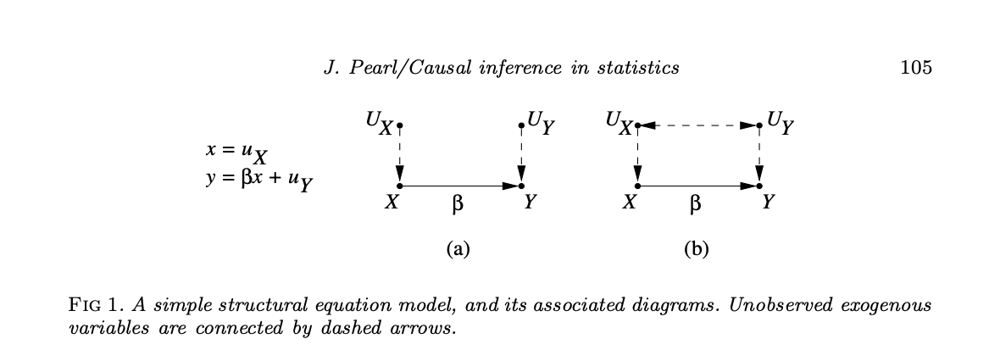
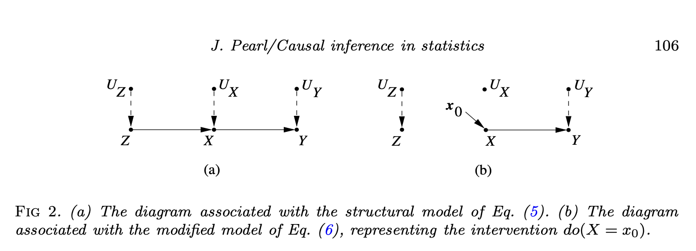

## 3.1. 結構方程模型簡介

如何用數學表達一個常見的理解，即症狀不會引起疾病？對於這一關係的最早數學表述，是由遺傳學家Sewall Wright（1921年）在1920年代提出的。Wright使用方程和圖形的組合來表達因果關係。例如，假設X代表一種疾病變數，Y代表該疾病的一個症狀，Wright會寫下如下線性方程式：^6

```
y = βx + uY  (1)
```

其中，x代表疾病的程度（或嚴重性），y代表症狀的程度（或嚴重性），uY代表在固定X的情況下，除了疾病之外可能影響Y的所有因素。在解釋這個方程時，我們應該將其看作一個物理過程，其中自然界根據x和u的值來分配變數Y的值y = βx + uY。同樣，要“解釋”疾病X的發生，可以寫成x = uX，其中UX代表所有影響X的因素。

方程（1）仍然無法正確表達這一分配過程所隱含的因果關係，因為代數方程是對稱的；如果我們將（1）重寫為

```
x = (y − uY) / β  (2)
```

它可能會被誤解為症狀影響疾病。為了表達這一過程的方向性，Wright用一個圖形來增強這個方程，這個圖後來被稱為“路徑圖”（path diagram），在圖中，箭頭從（感知的）原因指向它們（感知的）結果，更重要的是，箭頭的缺失表明自然界將一個變數的值分配給另一個變數時，與後者無關。例如，在圖1中，從Y到X的箭頭缺失表示症狀Y不是影響疾病X的因素UX之一。因此，在我們的例子中，症狀和疾病的完整模型可以寫成圖1所示：該圖表達了X對Y的（直接）因果影響的可能性，並表明Y對X沒有因果影響，而方程則編碼了變數之間的定量關係，這些關係將從數據中確定。方程中的參數β稱為“路徑係數”，它量化了X對Y的（直接）因果效應；給定β和UY的數值，方程宣稱，X的單位增加將導致Y的β單位增加，而不論模型中其他變數的值如何，也不論X的增加是來自外部還是內部影響。



變數UX和UY被稱為“外生變數”（exogenous）；它們代表觀察到或未觀察到的背景因素，模型設計者決定將其保持為未解釋的變數，即影響其他變數（稱為“內生變數”）但不受其影響的因素。未觀察到的外生變數有時被稱為“擾動”或“誤差”，它們代表被排除在模型之外但被認為對解釋模型中變數的行為具有相關性的因素。例如，變數UX代表影響疾病X的因素，這些因素可能與UY（影響症狀Y的因素）相關，也可能不相關。因此，結構方程中的背景因素本質上不同於回歸方程中的殘差項。後者是分析的人工產物，根據定義，與回歸變數無關；而前者是物理現實的一部分（例如遺傳因素、社會經濟條件），它們對數據中觀察到的變異負有責任；它們被視為任何其他變數，儘管我們通常無法精確測量它們的值，只能認可它們的存在並定性評估它們與系統中其他變數的關係。

如果假設可能存在相關性，通常會用虛線雙箭頭連接這兩個變數，UY和UX，如圖1（b）所示。

在閱讀路徑圖時，通常使用親屬關係，如父母、子女、祖先和後代，這些關係的解釋通常是顯而易見的。例如，一個箭頭X→Y表示X是Y的父母，Y是X的子女。一個“路徑”是任何一個連續的邊序列，無論是實線還是虛線。例如，在圖1（b）中，X和Y之間有兩條路徑，一條由直接箭頭X→Y構成，另一條則沿著節點X、UX、UY和Y。

Wright對因果分析的主要貢獻，除了引入路徑圖語言外，還有發展了寫出任何一對觀察變數的協方差的圖形規則，並且將其與誤差項的協方差結合。在我們的簡單示例中，我們可以立即寫出如下關係：

```
Cov(X, Y) = β  (3)
```

對於圖1（a），以及

```
Cov(X, Y) = β + Cov(UY, UX)  (4)
```

對於圖1（b）（當然這些可以從方程中推導出來，但對於較大的模型，代數方法往往會掩蓋推導出來的量的來源）。

在某些條件下（例如，如果Cov(UY, UX) = 0），這樣的關係可能允許僅通過觀察到的協方差項來解決路徑係數，這相當於從觀察到的非實驗性聯繫中推斷（直接）因果效應的大小，當然，前提是我們準備好辯護圖中編碼的因果假設。

需要注意的是，在路徑圖中，因果假設不是通過連接來編碼的，而是通過缺失的連接來編碼的。箭頭僅表示因果聯繫的可能性，其強度需要從數據中確定；缺失的箭頭表示零影響的假設，而缺失的雙箭頭則表示零協方差的假設。例如，在圖1（a）中，允許我們識別直接效應β的假設是通過缺失的雙箭頭連接UX和UY來編碼的，這表示Cov(UY, UX) = 0，以及缺失的從Y到X的箭頭。如果這兩個連接中的任何一個被添加到圖中，我們將無法識別直接效應β。這樣的新增將放寬假設Cov(UY, UX) = 0，或者放寬假設Y不影響X。

還需要注意的是，這兩個假設都是因果性的，而非關聯性的，因為這些假設無法從觀察變數X和Y的聯合密度中確定；未觀察項UY和UX之間的關聯只能在實驗設置中揭示出來；或者（在更複雜的模型中，例如圖5）來自其他因果假設。



圖2。 (a) 伴隨方程（5）的結構模型的圖。 (b) 伴隨方程（6）修改後的模型的圖，表示介入do(X=x₀)。

雖然每一個單獨的因果假設無法進行檢驗，但模型中所有因果假設的總和通常具有可檢驗的含義。例如，圖2(a)中的鏈條模型編碼了七個因果假設，每一個假設對應於一對變數之間缺失的箭頭或雙箭頭。這些假設中的任何一個單獨來看都是不可檢驗的，但這些假設的總和意味著在X的每一層次中，Z與Y之間是無關的。這樣的可檢驗含義可以通過一個圖形標準來從圖表中讀出，這個標準被稱為d-分離（d-separation）（Pearl, 1988）。

**定義1 (d-分離)**：如果一組節點S阻斷了路徑p，則稱為d-分離。具體而言，(i)如果p包含至少一個發出箭頭的節點且該節點屬於S，或(ii)如果p包含至少一個碰撞節點且該節點不屬於S並且在S中沒有後代。若S阻斷了從X到Y的所有路徑，則稱S“d-分離X和Y”，此時X和Y在給定S的情況下是獨立的，記作X⊥⊥Y|S。

舉例來說，路徑UZ→Z→X→Y被S={Z}和S={X}阻斷，因為每個節點都在該路徑上發出了箭頭。因此，我們可以推斷，在該模型生成的任何概率函數中，條件獨立性UX⊥⊥Y|Z和UZ⊥⊥Y|X都將成立，無論我們如何參數化箭頭。同樣，路徑UZ→Z→X←UX被空集{∅}阻斷，但不被S={Y}阻斷，因為Y是碰撞節點X的後代。因此，邊際獨立性UZ⊥⊥UX將在分佈中成立，但UZ⊥⊥UX|Y可能成立也可能不成立。這種對碰撞節點的特殊處理（例如Z→X←UX）反映了已知的Berkson悖論（Berkson, 1946），即觀察到兩個獨立原因的共同後果會使這兩個原因變得依賴。例如，兩枚獨立硬幣的結果通過證明至少有一個是反面來使它們變得依賴。

由d-分離所誘導的條件獨立性構成了結構方程模型中體現的假設面對非實驗數據檢驗的主要途徑。換句話說，幾乎所有能夠使模型無效的統計檢驗，都可以從這些含義中推導出來。^7

(^7) 一些具有相關誤差的圖形中可能會推導出額外的含義，稱為“潛在獨立性”（dormant independence）（Shpitser and Pearl, 2008）。

