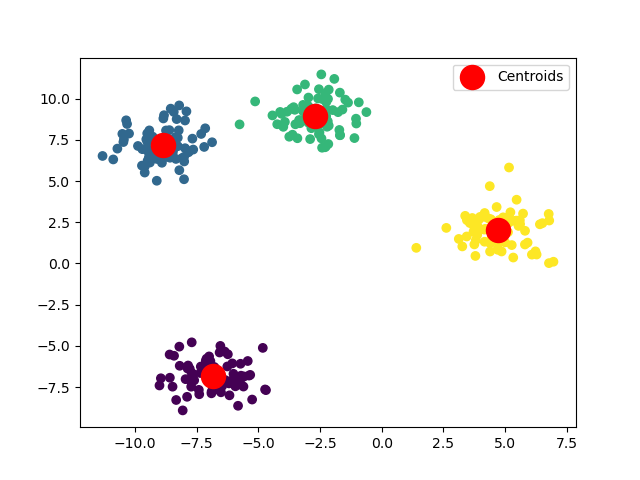

ChatGPT:

https://chatgpt.com/c/67036a09-57fc-8012-b27e-ad9a88c64b5a

```
python kmean1.png
```




ChatGPT

這是一個簡單的 K-Means 演算法的 Python 實現範例。這個範例將數據分成 \( k \) 個群組，並且使用歐幾里得距離來衡量數據點和質心之間的距離。

### Python K-Means 實現

```python
import numpy as np
import matplotlib.pyplot as plt
from sklearn.datasets import make_blobs

# 生成範例數據
def generate_data(n_samples=300, n_features=2, centers=4, random_state=42):
    X, _ = make_blobs(n_samples=n_samples, n_features=n_features, centers=centers, random_state=random_state)
    return X

# 計算兩點之間的歐幾里得距離
def euclidean_distance(a, b):
    return np.sqrt(np.sum((a - b) ** 2))

# KMeans 演算法
class KMeans:
    def __init__(self, k=3, max_iters=100):
        self.k = k
        self.max_iters = max_iters
        self.centroids = None
        self.labels = None

    def fit(self, X):
        # 隨機初始化 k 個質心
        self.centroids = X[np.random.choice(X.shape[0], self.k, replace=False)]
        
        for _ in range(self.max_iters):
            # 分配每個點到最近的質心
            self.labels = self._assign_clusters(X)
            
            # 計算新的質心
            new_centroids = self._calculate_centroids(X)
            
            # 如果質心不再改變，則停止
            if np.all(self.centroids == new_centroids):
                break
            self.centroids = new_centroids

    def _assign_clusters(self, X):
        # 計算每個點到每個質心的距離，並分配到最近的質心
        labels = np.zeros(X.shape[0])
        for i, point in enumerate(X):
            distances = [euclidean_distance(point, centroid) for centroid in self.centroids]
            labels[i] = np.argmin(distances)
        return labels

    def _calculate_centroids(self, X):
        # 根據每個群組中的點計算新的質心
        centroids = np.zeros((self.k, X.shape[1]))
        for i in range(self.k):
            points_in_cluster = X[self.labels == i]
            centroids[i] = np.mean(points_in_cluster, axis=0)
        return centroids

    def predict(self, X):
        # 預測每個點屬於哪個群組
        labels = self._assign_clusters(X)
        return labels

# 可視化結果
def plot_clusters(X, kmeans):
    plt.scatter(X[:, 0], X[:, 1], c=kmeans.labels, cmap='viridis')
    plt.scatter(kmeans.centroids[:, 0], kmeans.centroids[:, 1], s=300, c='red', label='Centroids')
    plt.legend()
    plt.show()

# 主程序
if __name__ == "__main__":
    # 生成範例數據
    X = generate_data(centers=4)
    
    # 訓練 KMeans 模型
    kmeans = KMeans(k=4)
    kmeans.fit(X)
    
    # 可視化結果
    plot_clusters(X, kmeans)
```

### 說明：

1. **`generate_data` 函數**：用來生成模擬數據，這裡使用 `sklearn.datasets.make_blobs` 來生成不同中心的數據。
2. **`KMeans` 類**：實現了 K-Means 演算法，包含以下方法：
   - `fit`：用來訓練模型，通過迭代更新質心，直到質心不再變化或達到最大迭代次數。
   - `_assign_clusters`：根據質心分配每個數據點到最近的群組。
   - `_calculate_centroids`：根據分配的結果更新質心位置。
   - `predict`：用於預測新數據點的群組。
3. **`plot_clusters` 函數**：用於繪製分群結果和質心。

### 使用步驟：
- 首先生成範例數據，設定群組數為 4（`centers=4`）。
- 使用 K-Means 對數據進行訓練，並可視化結果。

這個範例簡單易懂，可以幫助你理解 K-Means 演算法的基本工作流程。