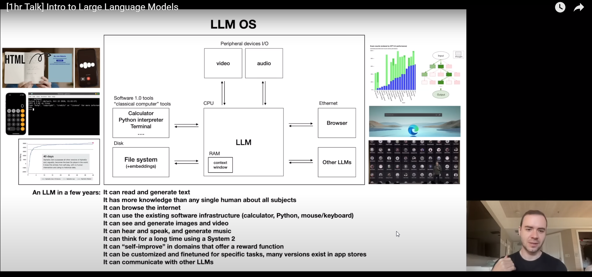

* [1hr Talk -- Intro to Large Language Models](https://www.youtube.com/watch?v=zjkBMFhNj_g) , 
Andrej Karpathy

摘要：

1. Pretraining: 用大量語料 (100TB) 去學習預測下一個字，建立語言模型 ($200M, 12 days)
2. Finetuning into assistant: 用高品質的 QA (100K) 問答，微調此模型 (1day) ，上線 deploy
    * 然後蒐集該模型的錯誤，用人力去 Label 修正 QA 再訓練微調模型。
    * 另一種 Label 方法是用人工排序，再用這個排序去訓練 AI
    * 這個過程會用 AI 介入，像是產生 draft，然後人工再去觀看並標記，然後 LLM 再去看人工的結果並 review 修正

評量方法： Elo Rating

* [Wikipedia:Elo Rating 等級分](https://zh.wikipedia.org/zh-tw/%E7%AD%89%E7%BA%A7%E5%88%86)

有兩種 LLM 的 AI，一種是直覺反射的 (System1)，另一種需要仔細思考的 (System2)，例如：

1. 直覺反射 System 1： 2+2=4, 
2. 仔細思考 System 2： 37254 + 1374 = ?, 下棋

目前 LLM 只在 System 1 做得好， System 2 不行，但 Alpha Go 這類的卻可以在 System 2 做得好

## 接下來幾年的可能發展

