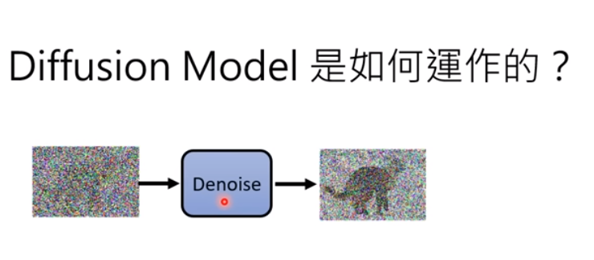
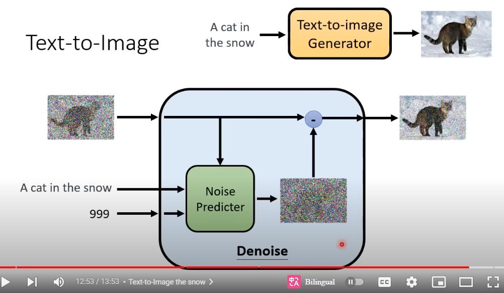
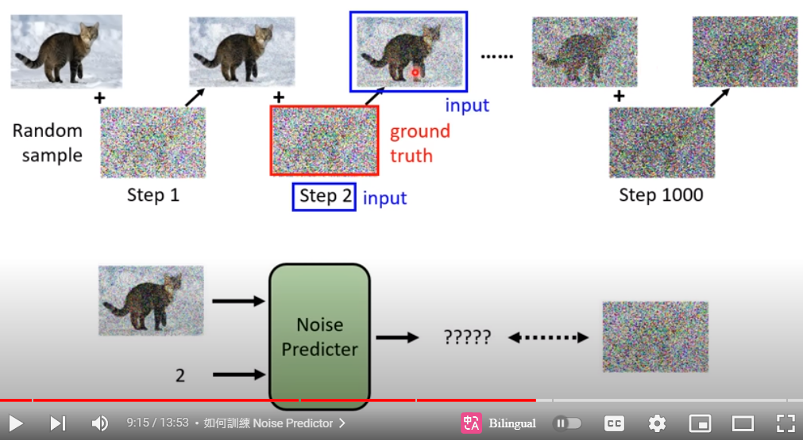
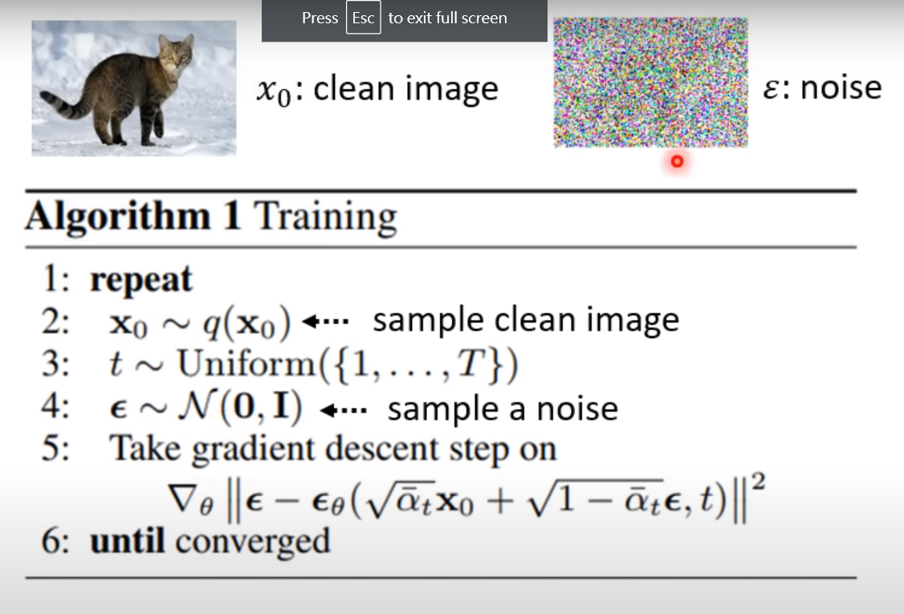
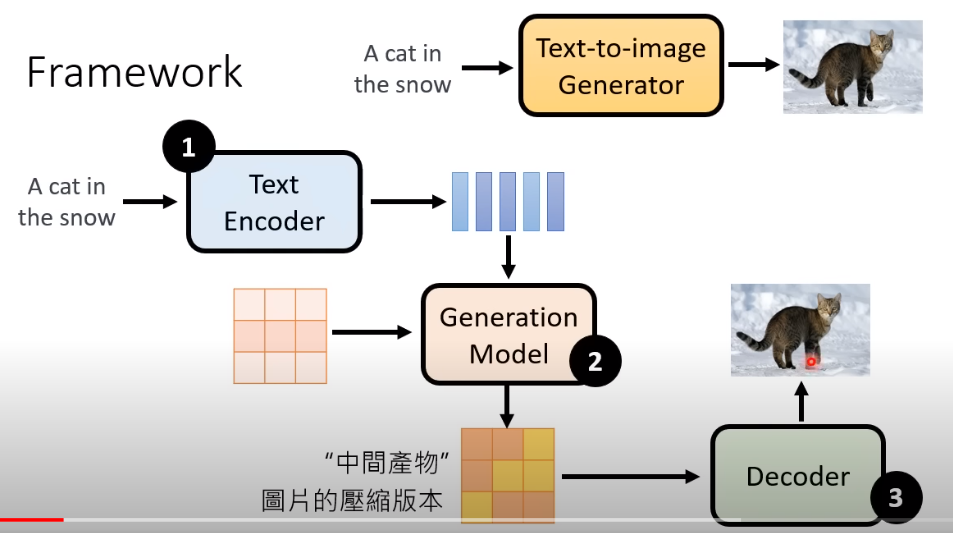
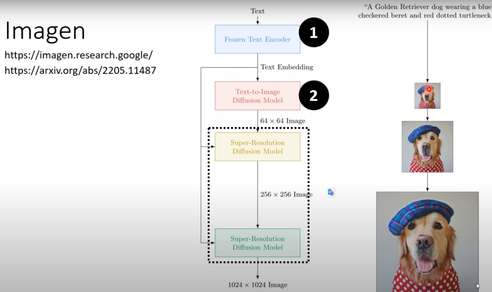

# Diffusion Model 的原理

論文： 

* [enoising Diffusion Probabilistic Models(PDF)](https://arxiv.org/pdf/2006.11239.pdf)

## 圖片來源：李宏毅教學影片

* [YouTube 李宏毅: 淺談圖像生成模型 Diffusion Model 原理](https://www.youtube.com/watch?v=azBugJzmz-o) (讚)
    * [Diffusion Model 原理剖析 (1/4) (optional)](https://www.youtube.com/watch?v=ifCDXFdeaaM) (讚)
    * [Diffusion Model 原理剖析 (2/4) (optional)](https://www.youtube.com/watch?v=73qwu77ZsTM)
    * [Diffusion Model 原理剖析 (3/4) (optional)](https://www.youtube.com/watch?v=m6QchXTx6wA)
    * [Diffusion Model 原理剖析 (4/4) (optional)](https://www.youtube.com/watch?v=67_M2qP5ssY)
    * [Stable Diffusion、DALL-E、Imagen 背後共同的套路](https://www.youtube.com/watch?v=JbfcAaBT66U) (讚)

## 概念

1. 訓練樣本產生：
    * 對圖片不斷加少量雜訊，直到整張圖片變成雜訊為止
    * 實作上：連加 1000 次 N(0, 1) 的雜訊，最後就差不多都是雜訊了
    * 假設這些雜訊為 n1, n2, ... n1000
    * x0 (原圖), x1, x2, .... x1000 (全雜訊)
    * x1 = x0+n1, x2=x1+n2, ...., x1000 = x999+n1000

2. 訓練目標： 雜訊預測器 (Noice Predictor)
    * 給一張有雜訊的圖，輸出其中的雜訊。
    * 例如： 給 x50，輸出 n = sum(n[1..50])

3. Noice Predictor 的輸入：
    * 不是只有圖，還有 step i 與圖片描述 q

4. 從 text q 產生圖片 x
    * 不斷 denoise (1000 次)，從雜訊生成圖片
    
5. denoice 的方法

## Forward

## 影像訓練資料庫

1. 李宏毅 HW6: 70k
2. ImageNet: 1M
3. LAION: 5.85B

## 演算法

## 完整系統的架構

* [Stable Diffusion、DALL-E、Imagen 背後共同的套路](https://www.youtube.com/watch?v=JbfcAaBT66U) (讚)

Decoder 壓縮變大圖，不需要《文字描述》

所以任何圖片樣本都可用來訓練，樣本數很大 ...

